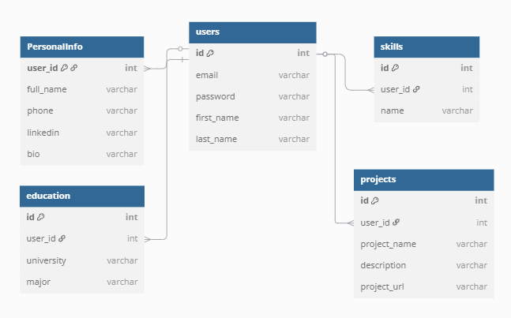

# Personal Portfolio Builder


## Description

The backend is built by using Django REST Framework (DRF). It handles user authentication using JWT, manages data models (Personal Info, Education, Skills, Projects), and exposes secure API endpoints. The backend ensures that each user can only access and modify their own data using permission classes and filtering by request.user. It also includes support for CORS to allow safe integration with the React frontend.


## Tech Stack

- Django REST Framework (DRF).
- Simple JWT .
- PostgreSQL .
- Django CORS Headers.


## Front End Repo Link

https://git.generalassemb.ly/mona96m/Portfolio-Frontend


## ERD diagram



## Routing Table

| Method        | URL                       | Description                      |
|---------------|---------------------------|----------------------------------|
| POST          | /token/                   | Get JWT access & refresh tokens  |
| POST          | /token/refresh/           | Refresh access token             |
| POST          | /signup/                  | Register a new user              |
| GET/POST      | /personalinfo/            | List/Create personal info        |
| PATCH /DELETE | /personalinfo/<int:pk>/   | Update/Delete personal info by ID|
| GET/POST      | /educations/              | List and Create education        |
| PATCH /DELETE | /educations/<int:pk>/     | Update/Delete education by ID    |
| GET/POST      | /skills/                  | List and Create skills           |
| PATCH /DELETE | skills/<int:pk>/          | Update/Delete skill by ID        |
| GET /POST     | /projects/                | List/Create projects             |
| PATCH /DELETE | projects/<int:pk>/        | Update/Delete project by ID      |


## Installation Instructions as Needed

#### Clone the project
```git clone https://git.generalassemb.ly/mona96m/Portfolio-Backend```
#### Activate a virtual environment
```pipenv shell```
#### Run migrations
```python manage.py migrate```   
#### Run server
```python manage.py runserver```    


## Icebox Features

- **Add Cover Letter Support**
Let users create and save a cover letter along with their portfolio.

- **Portfolio PDF Generator**
Create an endpoint that returns the full portfolio as a downloadable PDF.


